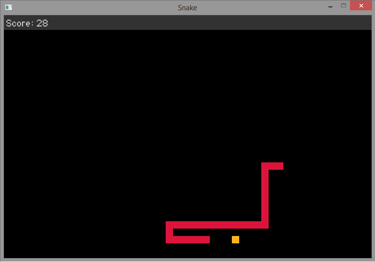

After few months playing around with JavaScript and Node.js, also getting a good grasp about it. This time I'm looking for a new challenge by learning another programming language, and C++ is the answer.

Written in C++ with the help of [SDL2](https://github.com/libsdl-org/SDL) as library. This project is heavily inspired by an old game that I'm sure everyone knows, Snake game! Not Snakes & Ladders. Maybe you're interested to read some facts about the very first Snake game [here](https://blogs.windows.com/devices/2012/02/02/snake-charmed-10-fascinating-facts-about-the-worlds-most-popular-game).

#### [Installation Guide](Installation.md)

#### Key Control
- `W` or `Arrow Up` to move up.
- `S` or `Arrow Down` to move down.
- `A` or `Arrow Left` to move left.
- `D` or `Arrow Right` to move right.
- `Esc` to quit from the game.